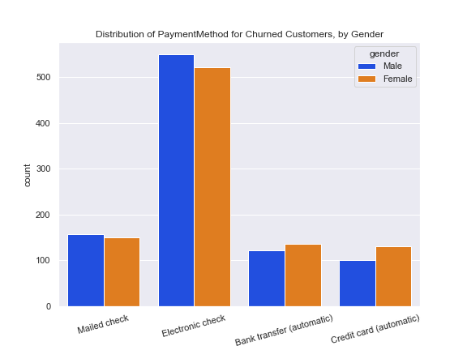
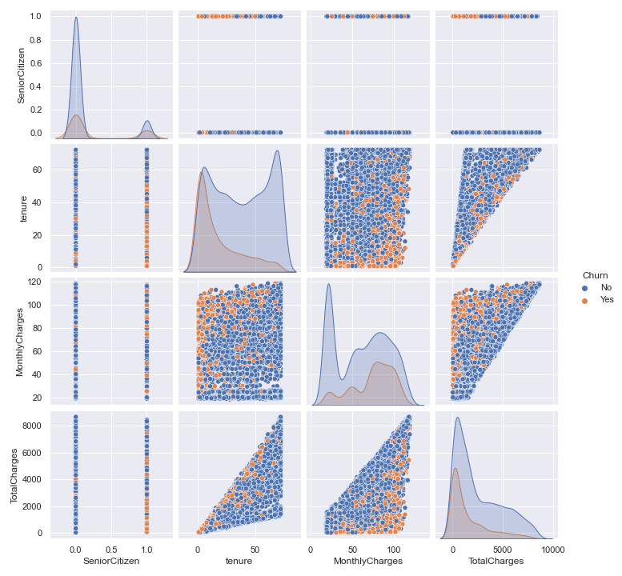

#  ClASSIFICATION PROJECT: - Predicting Customer Churn- MVP

### EDA
* In the figure below, our univariate analysis revealed the rate of churn among senior citizens is very high, compared to non senior citizens.

* We can also see from the barcharts below that, while performing a univariate analysis on gender gave little insights, infact almost even ratio, bivariate analysis reveals that males with electronic check payment type churns the most. 

### Baseline Model

The few numerical features in our data produced the pairplot above. we used these few features to build a baseline logistic regression model. For o The results which is illustrated in the figure below shows there lots of room for improvement.

For our business purpose, we would like to ensure that we catch as much churns, so we will make recall and f2 score our priority, which is captured in the immage above. Though we do not want to predict churn when a customer will not but unability to predict churn will potentialy cost the business money. 

