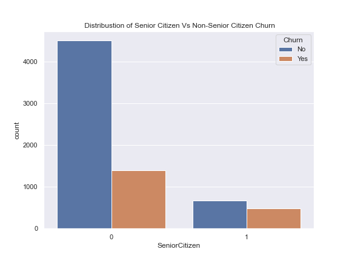
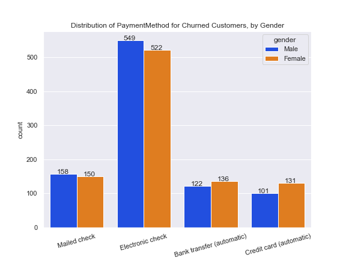
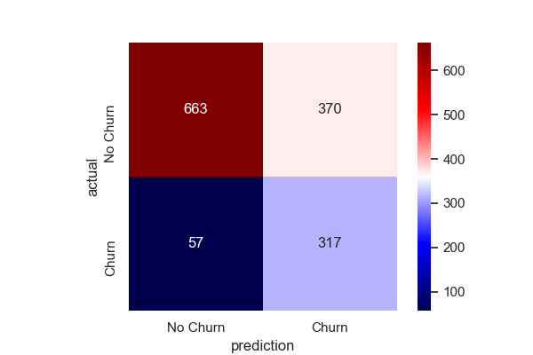
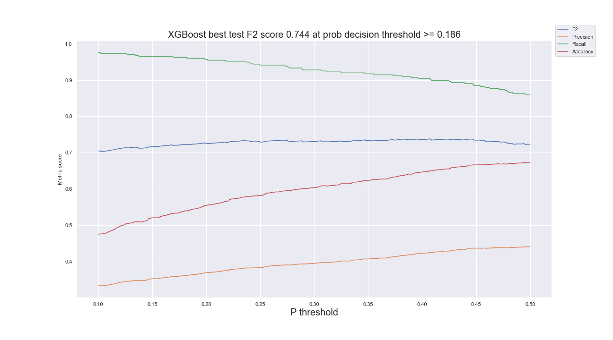

#  ClASSIFICATION PROJECT: - Predicting Customer Churn

## Final Write-up

### Abstract:
Customer churn refers to the process of identifying customer/ clients who will terminate their relations with an organisation. It is very important aspect of an organisation as it helps to measure the growth of the company. Hence, The purpose of this project is to build a model to predict if a given customer will churn or not churn using various classification algorithms and techniques

### Design
* I will build a model to answer questions like "Looking at this customers given data, will he/she churn in X months"
* My initial baseline model was with Logistic regression with an F2 score of about 0.4.
* I built upon that by using various techniques like class imbalance techniques, cross-validation, and different models with hyperparameter tuning to achive an optimal F2-score which we are about.    

### Data 
* The data for this project was obtained from a public data bank source - Kaggle.com and can be found [here](https://www.kaggle.com/blastchar/telco-customer-churn)
* Data will contain about 7,000 observations and some 21 features to explore.
* One individual row in the data signifies one unique observation of a customer's behavior (features)  
Tha data will be stored in a SQL for faster and easy precessing.

### Algorithm
#### EDA
* In the figure below, our univariate analysis revealed the rate of churn among senior citizens is very high, compared to non senior citizens.

 We can also see from the bar charts below that, while performing a univariate analysis on gender gave little insights, infact almost even ratio, bivariate analysis reveals that males with electronic check payment type churns the most.

### Modeling

* The main algorithm was a predictive classification models that was able to give as much accuracy score as possible. I ended up with an R2 score of .7 with a decision threshold at .22 

* For the purpose of the business, I ensured that we catch as much churns, so we will make recall and f2 score our priority. Though we do not want to predict churn when a customer will as we do not want to waste resources on customers the are not going to churn, but unability to predict churn will potentialy cost the business money as the business spends a lot of money to gain new customers and not so much to retain existing ones. 
below is a few coparable models that were tried including the chosen model-Random forest with hyper perameter tuning

   
### Tools:
* Data Acquisition and storage and Modeling
  * Python  
  * pandas
  * SQL
  * Scikit-learn

### Api
The project has been packaged as an api with flask and deployed to the docker hub.
 * Deployment
   * Flask
   * Docker 

